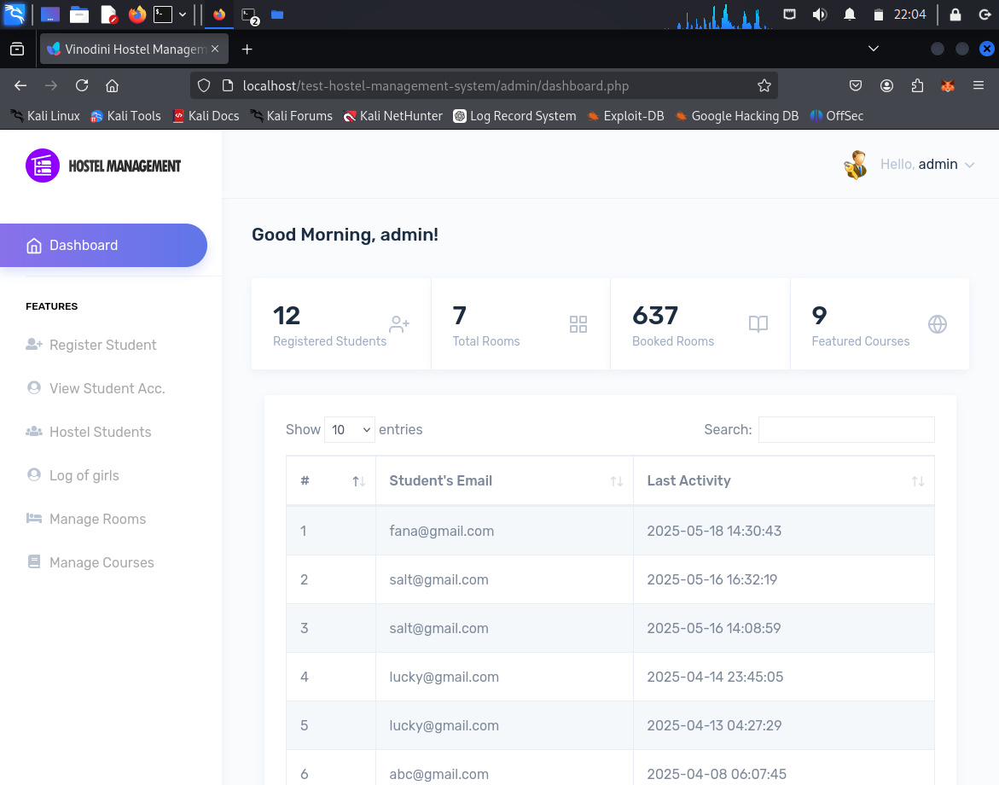
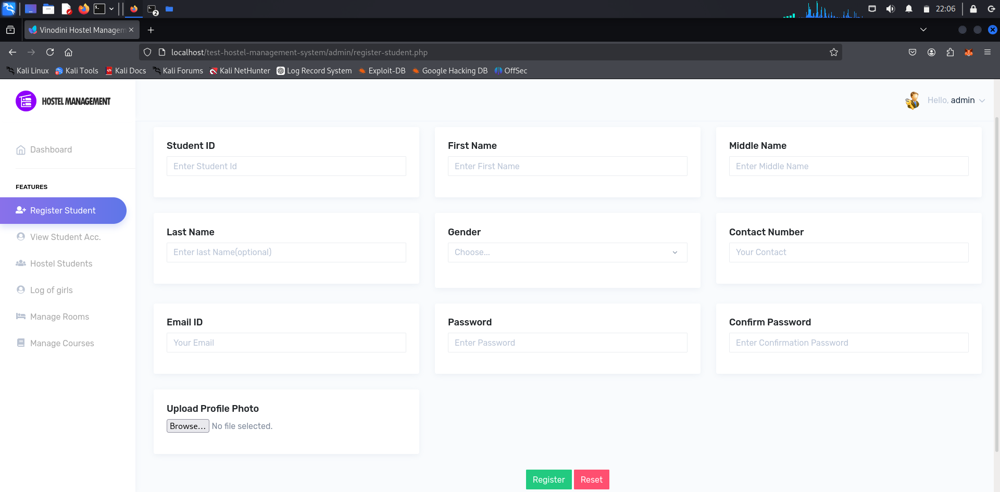
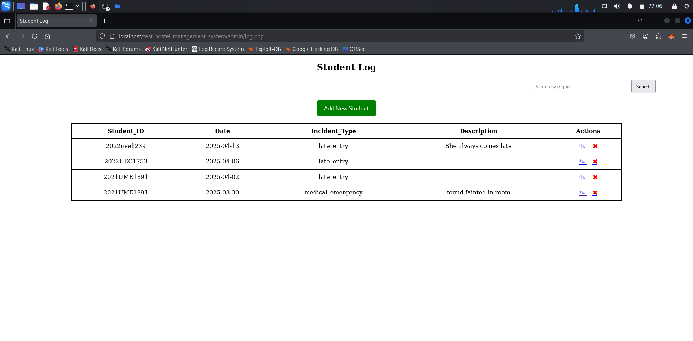
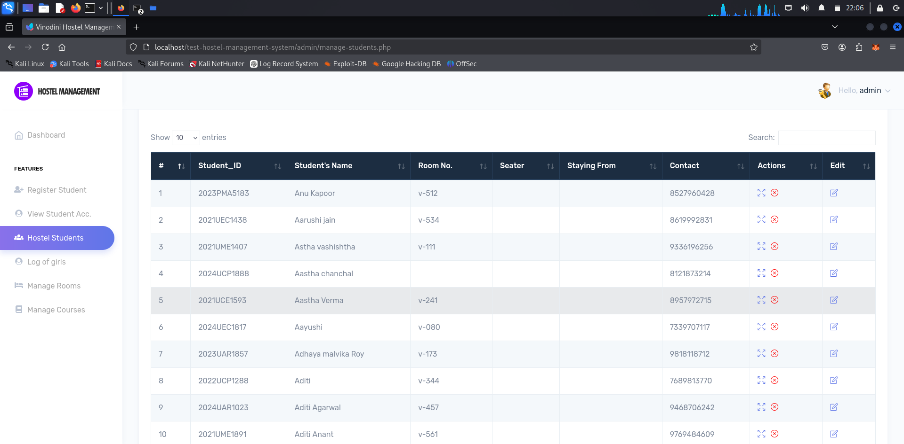

# Hostel Management System 
A web-based **Hostel Management System** to digitalize hostel administration.  
Manages **student registration, room allotments, student accounts, late-entry logs**, and provides separate dashboards for **admins** and **students**.

---

## Features
### 👨‍💻 Admin Side
- Admin login and secure password change
- Dashboard to view statistics and recent activity
- Student registration management (create / edit / delete)
- Room allotment and vacancy tracking
- Register students
- View and manage student late-entry logs
- Manage student account statuses (active/suspended)

---

### 👩 Student Side
- Student login and password change
- Student dashboard showing profile & room details
- Update profile (with verification by admin)
- View allotment history
- Log late entry (timestamped)
- View log history

---

## Tech Stack
- **Frontend:** HTML, CSS, JavaScript (vanilla)  
- **Backend:** PHP (plain PHP or with lightweight routing)  
- **Database:** MySQL / MariaDB  
- **Server:** Apache (LAMP stack)  
- **Tested on:** Kali Linux (project placed under `/var/www/html/`)

---

## Installation & Setup

> This guide assumes a LAMP environment (Linux, Apache, MySQL, PHP). Adjust paths/commands for your setup.

### 1. Clone the repository
```bash
git clone git@github.com:raif-1488/Hostel-Management-System.git
cd Hostel-Management-System
```

### 2. Move project to web root
```bash
sudo mv Hostel-Management-System /var/www/html/test-hostel-management-system
cd /var/www/html/test-hostel-management-system
```

### 3. Start services
```bash
sudo service apache2 start
sudo service mysql start
```

### 4. Create database & import schema
Open MySQL CLI or phpMyAdmin and create a database, e.g. `hostel_db`.

Import the SQL schema:
```bash
mysql -u root -p hostel_db < database/schema.sql
```

### 5. Configure DB connection
Edit `config/db.php` (or similar) to set DB host, username, password, database name:
```php
<?php
$DB_HOST = 'localhost';
$DB_USER = 'root';
$DB_PASS = 'your_password';
$DB_NAME = 'hostel_db';
$mysqli = new mysqli($DB_HOST, $DB_USER, $DB_PASS, $DB_NAME);
?>
```

### 6. Set permissions (if needed)
```bash
sudo chown -R www-data:www-data /var/www/html/test-hostel-management-system
sudo chmod -R 755 /var/www/html/test-hostel-management-system
```

### 7. Open in browser
```
http://localhost/test-hostel-management-system/
```

---

## Admin Login Details
- **Username:** admin  
- **Password:** Vinodini@123  

---

## Screenshots  
  
  
  
  

---

## Contact
**Author:** Raif (GitHub: [raif-1488](https://github.com/raif-1488))  
**Email:** chhavinawria@gmail.com  
